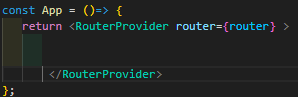

<<<<<<< HEAD
1) react with vite 
2) for different type of react icons 

npm install react-icons --save

3) koi bhi page refresh nahi hoga one page to another nevigate  

npm i react-router-dom

4) Axios - geting data of country from Apis

npm i axios
=======
5) from now react is 19 

npm install --save-exact react@rc react-dom@rc

6) npm run dev -- to start project 

7) creating router inside app.jsx 

const router = createBrowserRouter([
    {
      path: "/",
      element: <Home /> 
    }
   <!-- here we make object  -->
])

then add inside return in the app.jsx RouterProvider 

