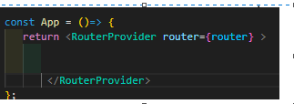

# Country_App

## Setup Instructions

### 1) React with Vite
Base setup using React with Vite for fast development.

### 2) React Icons
For different types of React icons in your project.
```bash
npm install react-icons --save
```

### 3) React Router DOM
Single page navigation - no page refresh when navigating between pages.
```bash
npm i react-router-dom
```

### 4) Axios
For fetching country data from APIs.
```bash
npm i axios
```

### 5) React 19
Installing React 19 release candidate and React DOM RC.
```bash
npm install --save-exact react@rc react-dom@rc
```

### 6) Starting the Development Server
Run the development server.
```bash
npm run dev
```

### 7) Router Setup in App.jsx

Create a router with `createBrowserRouter`:

```javascript
const router = createBrowserRouter([
    {
      path: "/",
      element: <Home /> 
    }
    // Add more routes here
])
```

Then add `RouterProvider` inside the return in `App.jsx`:

```javascript
<RouterProvider router={router} />
```




